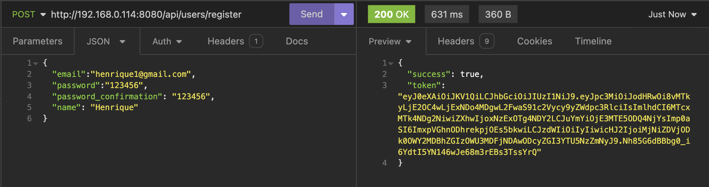
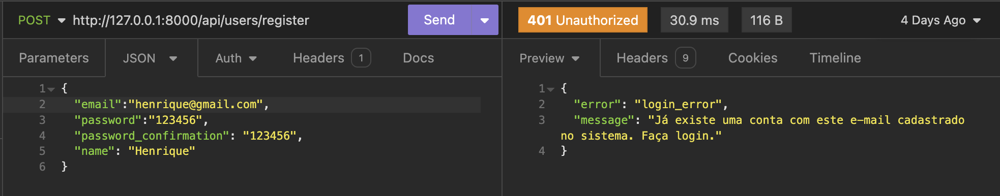
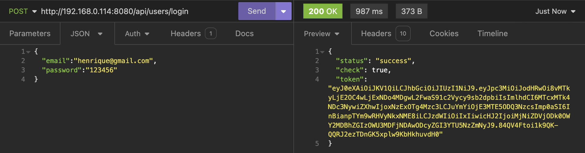
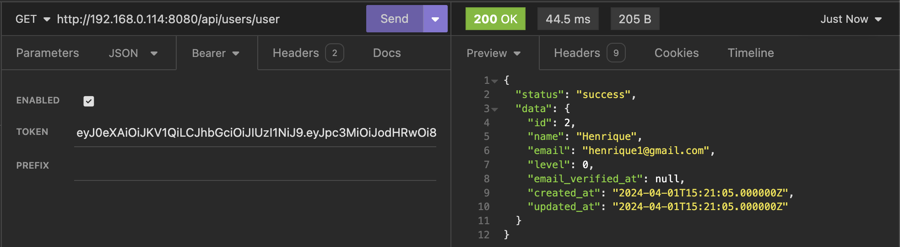
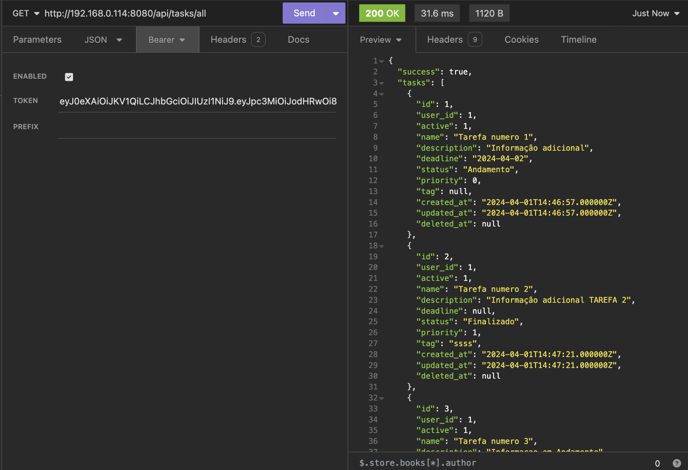
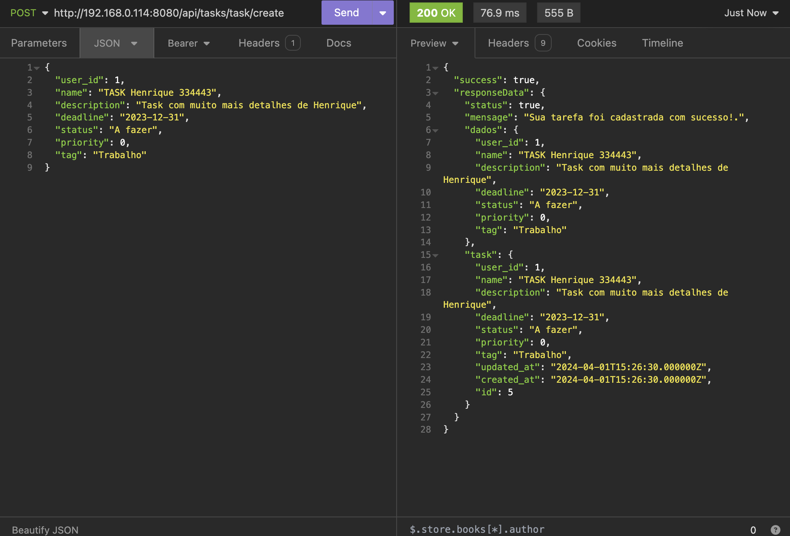
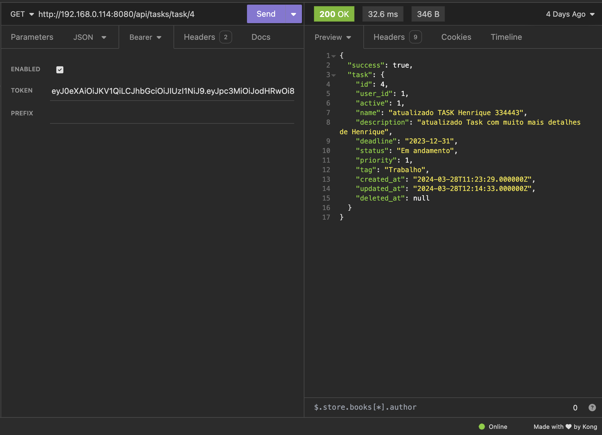
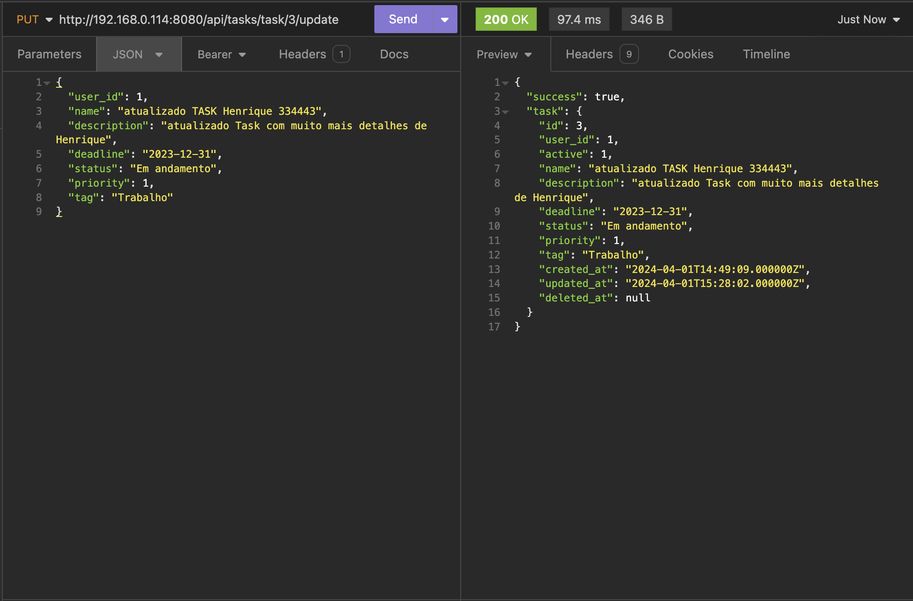
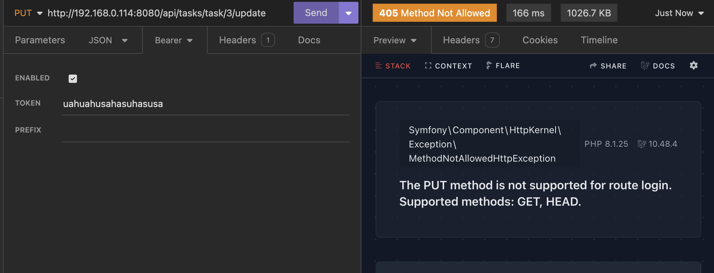
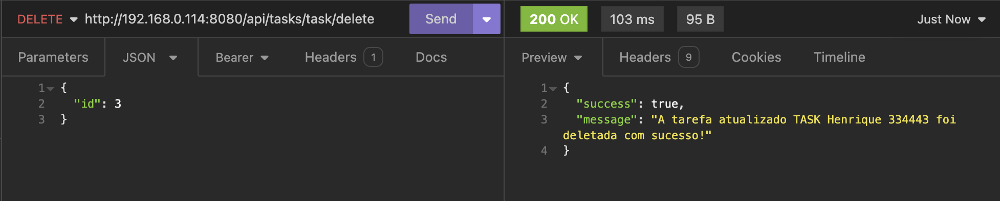

# Aplicativo

**Nome do Aplicativo:** Task Api
**Autor do Aplicativo:** Henrique Ribeiro
**Licença do Aplicativo:** MIT License
**Tecnologia do Aplicativo:** Laravel ^10.10

## Descrição

Api RESTful desenvolvido para teste técnico.
Objetivo: integração com aplicativo mobile desenvolvido em flutter.

## Funcionalidades

-   Adicionar terefa
-   Editar terefa
-   Deletar terefa
-   Listar terefas
-   Criar usuario
-   Autenticação com JWT
-   Logs organizado. Configurado em logging.php
-   Rotas protegidas por middleware

## Requisitos

-   [php: ^8.1]

## Instalação

[Necessário configurar arquivo .env . Projeto com banco de dados em mysql]

1. composer install
2. php artisan migrate
   [Necessário criar banco de dados e configurar no arquivo .env]
3. php artisan jwt:secret
4. php artisan serve --host=192.168.0.114 --port=8080
   [Adicionar o ip local em vez de 192.168.0.114]

## Uso

## Licença

Este projeto está licenciado sob a Licença MIT - consulte o arquivo [LICENSE](LICENSE) para obter mais detalhes.

## Contato

Henrique Ribeiro – ribeiro.henriquem@gmail.com

---

_Fique a vontade para entrar em contato atravez do e-mail._
